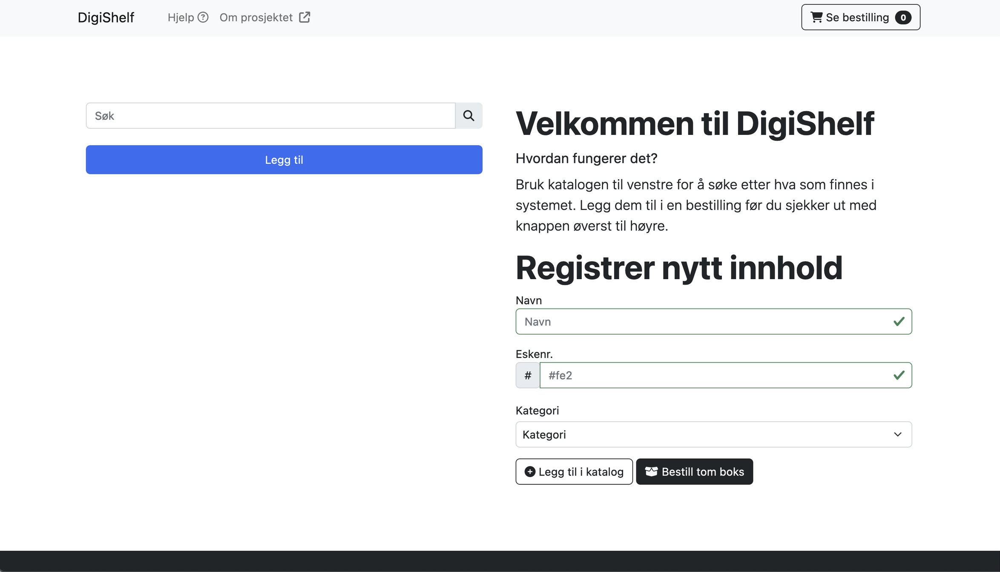

<h1>Automatisert Skapsystem</h1>

Dette prosjektet har som formål å automatisere et skap med et rutenett av 6x6 hull hvor bokser kan plasseres. Hver boks har en unik QR-kode på baksiden, som skannes av en arm på baksiden av skapet når en ny boks blir satt inn. Informasjon om boksens posisjon blir da lagret i en SQL-database. Et webgrensesnitt er tilgjengelig for å registrere bokser og legge inn bestillinger. Systemet er drevet av en Raspberry Pi, og motorene styres gjennom G-Code.

<h2>Hvordan det fungerer</h2>

For å bruke systemet kan du følge disse trinnene:

<ol><li>Registrere bokser ved å navigere til "Legg til boks"-fanen på webgrensesnittet og fylle ut informasjonen om boksen.</li><li>Legge inn en bestilling ved å gå til "Legg til bestilling"-fanen og velge produktene du ønsker å bestille fra rullegardinmenyen. Trykk deretter på "Bestill" knappen.</li><li>Systemet vil automatisk bevege armen rundt for å finne boksene som inneholder produktene i bestillingen. Når boksene er funnet, vil de bli skjøvet ut av skapet.</li></ol>

<h2>Teknologi</h2>

Dette prosjektet er bygget med følgende teknologier:

<table>
<thead>
    <tr><th>Teknologi</th><th>Beskrivelse</th></tr>
</thead>
    <tbody>
        <tr><td>Python</td><td>Hovedprogrammeringsspråket for alle bevegelige deler</td></tr>
        <tr><td>Flask</td><td>Web-rammeverk for kommunikasjon mellom webgrensesnittet og python</td></tr>
        <tr><td>HTML, CSS og JS</td><td>Språkene brukt for å skrive webgrensesnittet</td></tr>
        <tr><td>SQL</td><td>Database for å lagre informasjon om boksene</td></tr>
        <tr><td>raspberry pi</td><td>microcomputer for å styre systemet</td></tr>
        <tr><td>G-Code</td><td>Språk for å kontrollere bevegelse av motorene</td></tr>
    </tbody>
</table>

<h2>Lisens</h2>

Dette prosjektet er lisensiert under MIT-lisensen. Se LICENSE-filen for mer informasjon.

